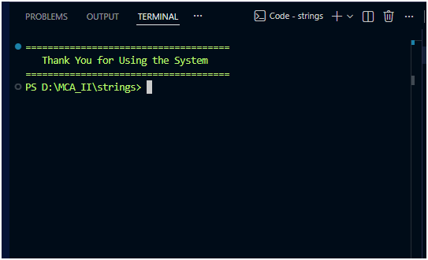
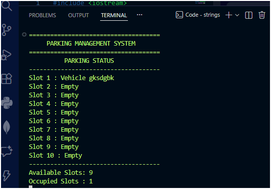
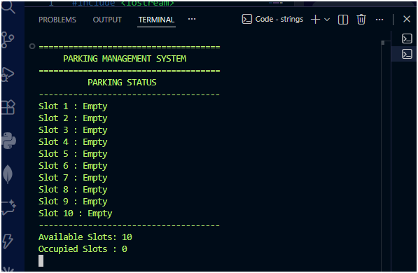
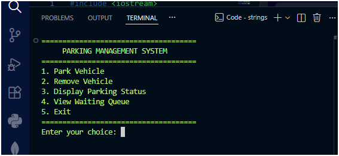

# 🚗 Parking Management System

<p align="center">
  <b>A Simple yet Efficient Console-Based Parking Management System in C++</b><br>
  Manage parking slots, vehicle flow, and waiting queues with ease.
</p>

---

## 📌 Overview

The **Parking Management System** is a console-based application built using **C++** that simulates real-world parking operations.  
It efficiently handles vehicle entry, exit, slot allocation, and waiting queues using core data structures.

---

## ✨ Key Features

- 🚘 Smart Parking Allocation  
- ⏳ Waiting Queue System (FIFO)  
- 🔄 Auto Slot Reassignment  
- 📊 Real-time Parking Status  
- 🧾 User-Friendly Interface  

---

## 🖼️ System Preview

### 🔹 Main Menu
<p align="center">
  
</p>

### 🔹 Parking Status
<p align="center">
  
</p>

### 🔹 Vehicle Entry / Exit
<p align="center">
  
</p>

### 🔹 Waiting Queue
<p align="center">
  
</p>

---

## 📄 Project Report

You can download the detailed project report from below:

- 📘 **DOC Format**: [Download Report](https://drive.google.com/file/d/1WSws9_vWP1e58hVn8el-jRUdBqTP2ACD/view?usp=sharing)  
- 📕 **PDF Format**: [Download Report](report.pdf)  

---

## ⚙️ Tech Stack

- 💻 Language: C++  
- 🖥️ Platform: Windows  

### 📚 Concepts Used:
- Queue (FIFO)  
- Arrays / Vectors  
- Loops & Conditions  
- String Handling  

---

## 🛠️ Installation & Setup

### 🔧 Compile

```bash
g++ ravi.cpp -o parking_system
